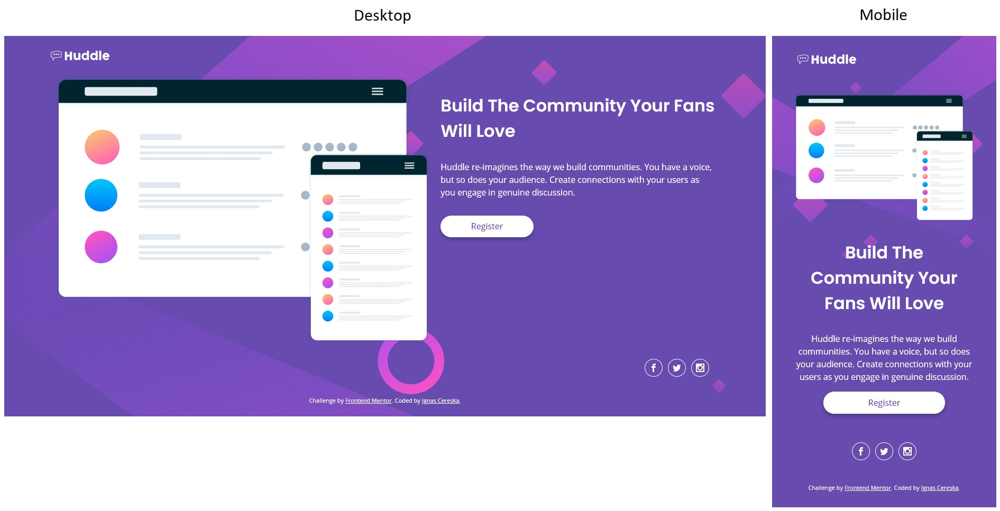

# Frontend Mentor - Huddle landing page with single introductory section solution

This is a solution to the [Huddle landing page with single introductory section challenge on Frontend Mentor](https://www.frontendmentor.io/challenges/huddle-landing-page-with-a-single-introductory-section-B_2Wvxgi0). Frontend Mentor challenges help you improve your coding skills by building realistic projects. 

## Table of contents

- [Overview](#overview)
  - [The challenge](#the-challenge)
  - [Screenshot](#screenshot)
- [My process](#my-process)
  - [Built with](#built-with)
  - [What I learned](#what-i-learned)
  - [Continued development](#continued-development)
  - [Useful resources](#useful-resources)
- [Author](#author)

## Overview

### The challenge

Users should be able to:

- View the optimal layout depending on their device's screen size
- See hover states for interactive elements

### Screenshot



## My process

### Built with

- HTML5 and CSS
- Flex box
- Visual Studio Code software

### What I learned

Seems like the following property is a nice and easy way to fit the image to cover the whole screen, maintain aspect ratio when scaling with exception that I am ok with it clipping outside of the screen:
```css
html {/*@media for desktop size*/
        background-image: url(../images/bg-desktop.svg);
        background-size: cover;
    }
```

First time using min-heigh and it seems to help me with keeping my body element at least as high as screen and, in case more room needed, it expands further and is not restricted by max-heigh limits

I can change color (to some extent at least) by using filter property. Here I changed black contacts icons to white color by inverting the image:
```css
.contactIcon > img {
    filter: invert(100);
}
```
BUT, after digging a bit more, found a more flexible approach by using images as a mask, to mask the background color of the element and then apply a rounded border to the parent element to create a circle:
```css
.contactIcon > * {
    background-color: white;
    /*box size to contain mask*/
    width: 32px;
    height: 32px;
    
    /*common mask settings*/
    mask-size: 50%;/*half size of the parent element*/
    mask-repeat: no-repeat;
    mask-position: center;
}
#facebook {
    mask-image: url(../images/icons/401-facebook.png);
}
#twitter {
    mask-image: url(../images/icons/407-twitter.png);
}
#instagram {
    mask-image: url(../images/icons/403-instagram.png);
}
li {
    border: 1px solid white;
    border-radius: 50%;
    margin: 5px;
}
/*hover transition*/
li:hover {
    border: 1px solid hsl(300, 69%, 71%);
}
li > div:hover {
    background-color: hsl(300, 69%, 71%);
}
```

First time tried to implement a float property for the button on desktop version, to align it on the left hand side and avoid creating another flex box:
```css
.button {
        max-width: 150px;
        float: left;
    }
```

For some reason, when @media kicks in to switch from mobile to desktop size, everything is overriden correctly except text alignment, unless !important is added to the end of the property. Not sure why this is an exception:
```css
h1, p {/*This property is within media query*/
        text-align: left !important;
    }
```

### Continued development

This challenge really put creativity to the test for me, as a beginner. The hardest part was to design the contact buttons using black images. After few trials and errors, managed to create what I think is a flexible button, as it can be changed easily to a different icon. Also, great experience sorting out background image with some new properties.

And finally, need to practice keeping things as simple as possible and using tags like header, section, footer in the right places.

### Useful resources

- (https://www.w3schools.com) - My main goto when I need to remember certain things in html and css.

## Author

- Frontend Mentor - [@ignasc](https://www.frontendmentor.io/profile/ignasc)
- Github - [@ignasc](https://github.com/ignasc)
- Twitter - [@Ignasc](https://twitter.com/Ignasc)
- Instagram - [@ignas.c](https://www.instagram.com/ignas.c/)
